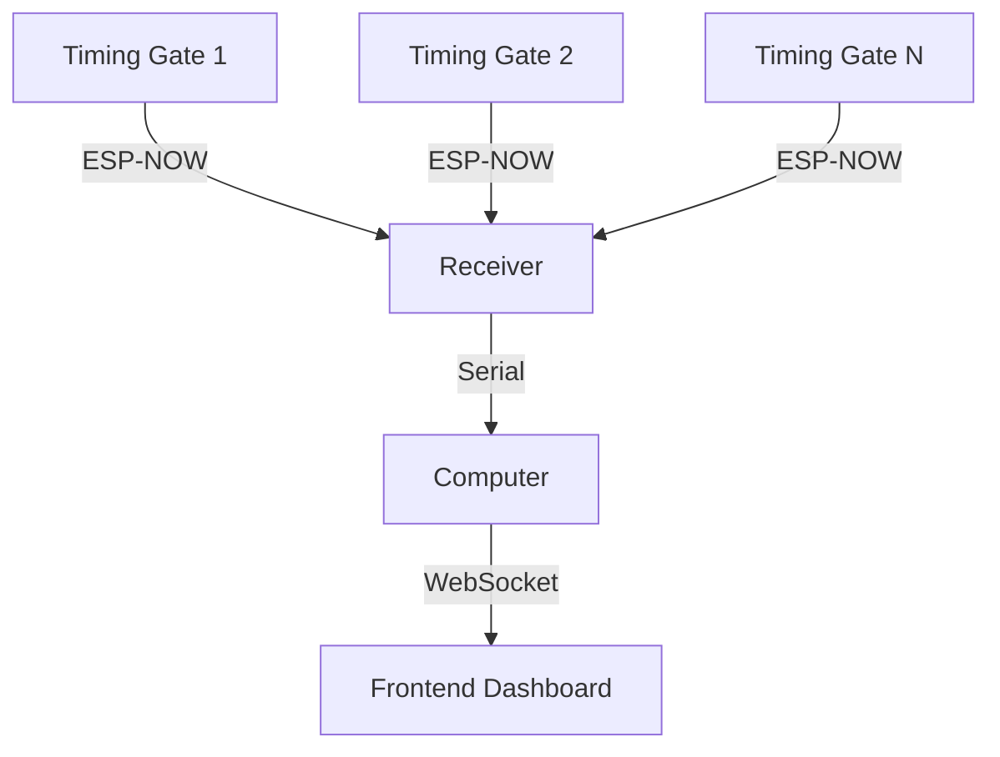

# Project Overview

## System Architecture

The FEB Timing Gates system is a wireless timing solution for racing events, consisting of:

1. **ESP32-based timing gates (senders)** - Devices that detect beam breaks and send timing data
2. **ESP32 receiver hub** - Central device that collects data from all timing gates
3. **Frontend dashboard** - Web application for visualizing timing data in real-time



## Project Structure

```
feb_timing_gates/
├── documentation/      # Documentation files
├── logs/               # System logs
├── scripts/            # Utility scripts
└── src/
    ├── esp32/          # ESP32 firmware
    │   ├── receiver.ino  # Receiver firmware
    │   ├── sender.ino    # Sender firmware
    │   └── tools/        # Development tools
    └── frontend/        # Web dashboard
        ├── src/          # Source code
        └── package.json  # Project configuration
```

## Key Components

### Hardware Components
- **XIAO ESP32C6 microcontrollers** - WiFi/Bluetooth enabled microcontrollers for wireless communication
- **BANNER QS18VN6LP Laser sensors** - Detect beam breaks when a vehicle passes through a timing gate
- **Grove Air530Z GPS modules** - Provide precise timing synchronization for all devices
- **LM2596 DC-DC Step Down Power Supply** - Regulate voltage for the timing gates
- **Dewalt Battery Adapters** - Provide portable power to the timing gates

### Software Components
- **ESP-NOW protocol** - Low-latency wireless communication between devices
- **Serial communication** - Receiver to computer data transfer
- **React frontend** - Real-time visualization of timing data
- **Web Serial API** - Browser-based communication with the receiver